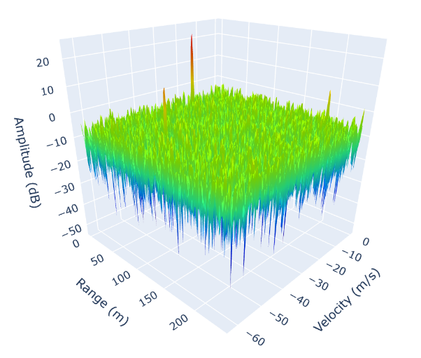
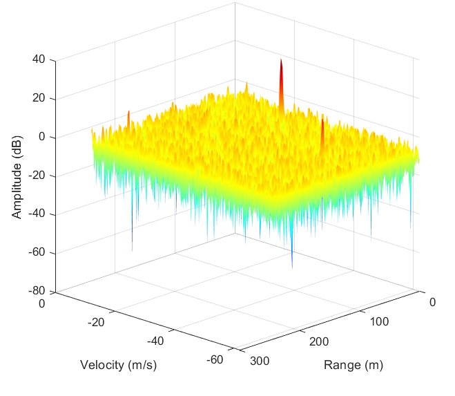
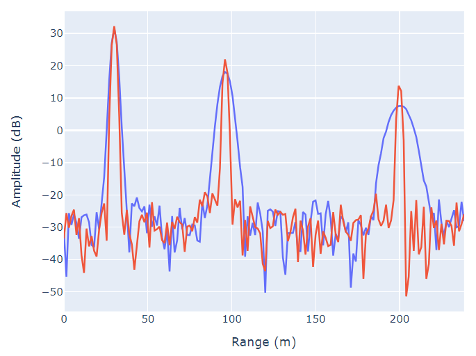
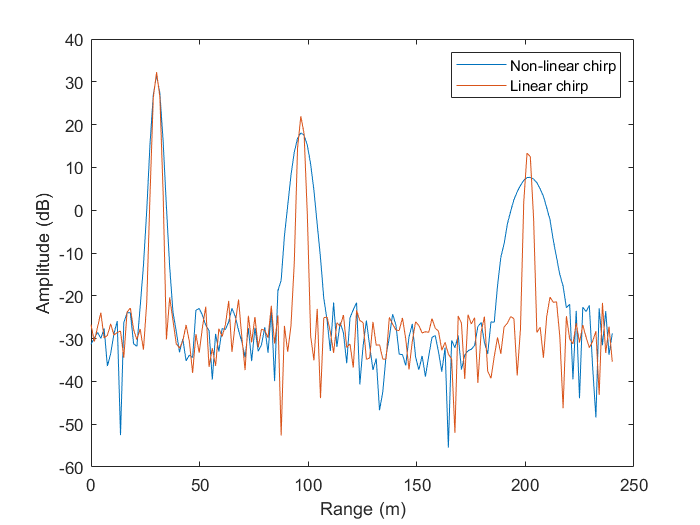
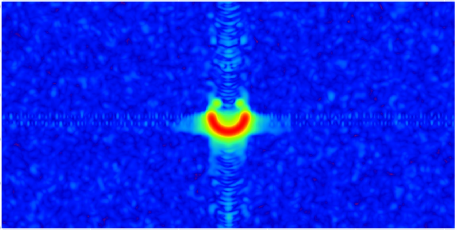
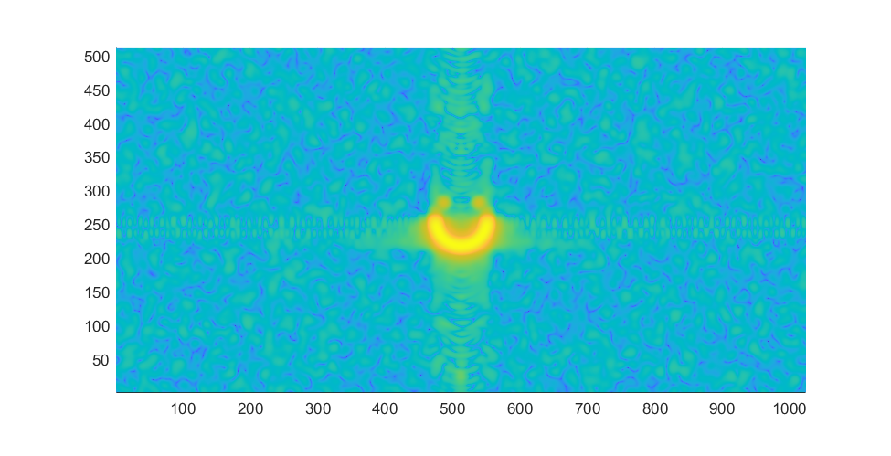
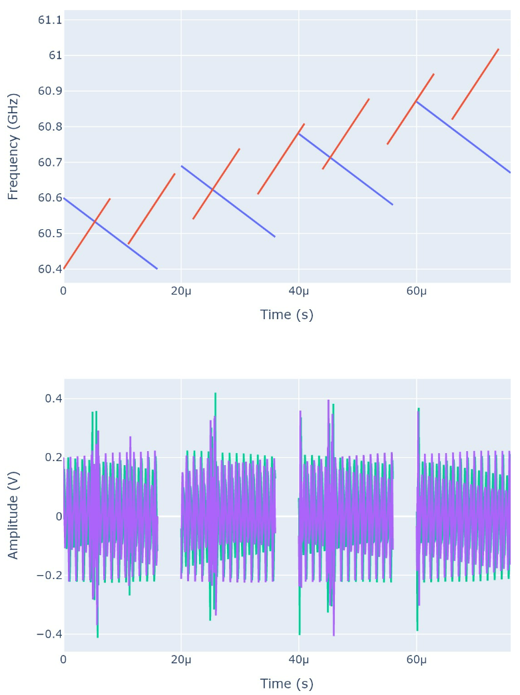
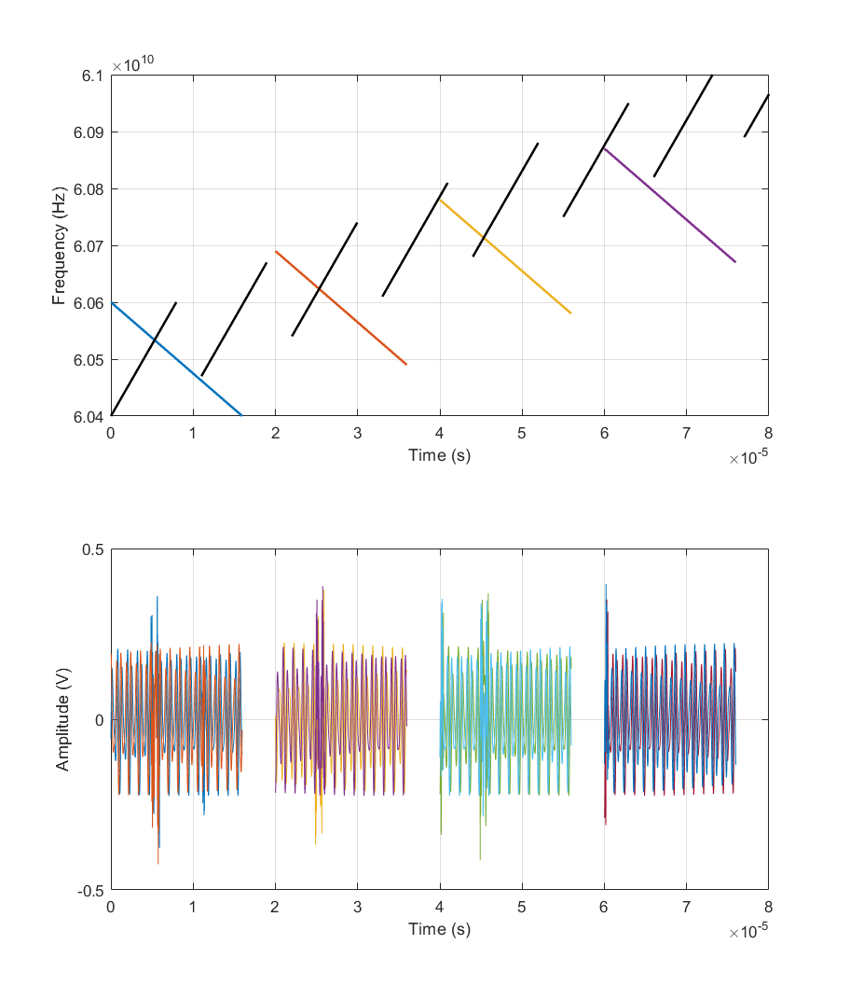

# RadarSimM


[](https://github.com/radarsimx/radarsimm/actions/workflows/matlab-tests.yml)

Radar Simulator for MATLAB.

## Introdcution

[`RadarSimM`](https://radarsimx.com/product/radarsimm/) is the MATLAB interface of RadarSimX. It utilizes the powerful C++/CUDA backend engine [`RadarSimCpp`](https://radarsimx.com/radarsimx/radarsimcpp/). This interface is designed to provide radar transceiver modeling and baseband simulation capabilities for both point targets and 3D models. It offers similar features as [`RadarSimPy`](https://radarsimx.com/product/radarsimpy/).

| RadarSimPy | RadarSimM |
| ---------- | --------- |
|  |  |
|  |  |
|  |  |
|  |  |

## Key Features

- ### Radar Modeling

  - Radar transceiver modeling
  - Arbitrary waveform
  - Phase noise
  - Phase/amplitude modulation
  - Fast-time/slow-time modulation

- ### Simulation

  - Simulation of radar baseband data from point targets
  - Simulation of radar baseband data from 3D modeled objects/environment
  - Simulation of interference
  - (TODO) Simulation of target's RCS
  - (TODO) Simulation of LiDAR point cloud from 3D modeled objects/environment

## Dependence

- MATLAB 64bit
- [MinGW-w64 C/C++ compiler](https://www.mathworks.com/support/requirements/supported-compilers.html) (Windows)

## Installation & Usage

- Download the compiled module from [RadarSimM](https://radarsimx.com/product/radarsimm/)
- Try the files in `examples`.

## Testing

Tests live in `tests/` and are written with the MATLAB unit testing
framework, split into two tiers:

- `tests/unit` — pure MATLAB. Covers the Tx/Rx channels, the point and mesh
  targets, the license guards, and the public class API. Runs with or without
  the compiled `radarsimc` backend; CI stages the backend for it so the tier
  is exercised against a complete package on every supported MATLAB release.
- `tests/integration` — drives the real simulator end to end: baseband
  shape and timestamps, range-FFT peaks against known target ranges, noise,
  real vs. complex baseband, ray-traced mesh targets, and interference.
  Requires `radarsimc` and `radarsim.h` in `src/+RadarSim`, so it runs on
  Windows, where `loadlibrary` can parse the exported C API.

Run everything from the repository root:

```matlab
run_tests
```

Run one tier, or a single test class:

```matlab
run_tests('unit')

addpath('src');
runtests('tests/unit/TxChannelTest.m')
```

Or from a shell:

```bash
matlab -batch "run_tests"
matlab -batch "run_tests('unit')"
```

The [`MATLAB Tests`](.github/workflows/matlab-tests.yml) workflow runs both
tiers on GitHub Actions with [matlab-actions](https://github.com/matlab-actions).
Everything runs on Windows, the only platform whose exported C API
`loadlibrary` can parse. A first job builds `radarsimc` from the `radarsimlib`
submodule with `build_win.bat --arch cpu --license on` and publishes the
resulting `radarsimc.dll` and `radarsim.h` as a build artifact. Both test jobs
then stage that artifact into `src/+RadarSim` together with the license from
the `TEST_LICENSE` secret (written as `license_RadarSimM_CI.lic`), so the unit
tier — run against R2022b, R2024b, and the latest MATLAB release — and the
integration tier both test the same installed package layout users get. JUnit
results and Cobertura coverage are uploaded as build artifacts.

The build job needs two repository secrets: `RADARSIMCPP` (deploy key for the
`radarsimlib`/`radarsimcpp` submodules) and `TEST_LICENSE` (the RadarSimM
license used for the licensed build). Neither is exposed to workflows
triggered by pull requests from forks, so the whole workflow is skipped for
those; pushes to a branch in this repository run it in full.
