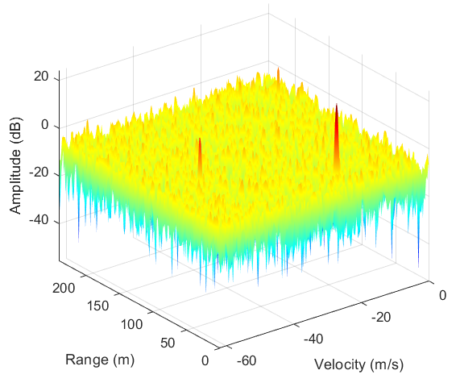
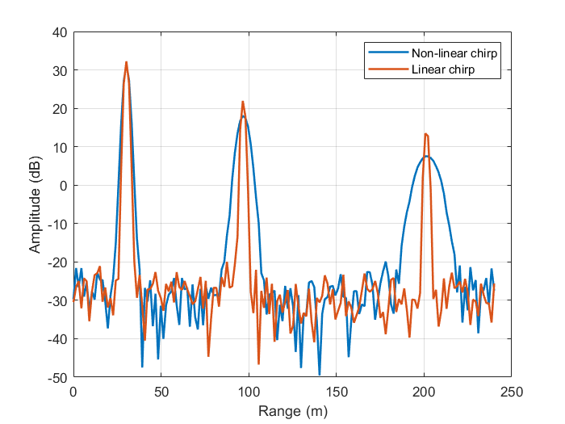
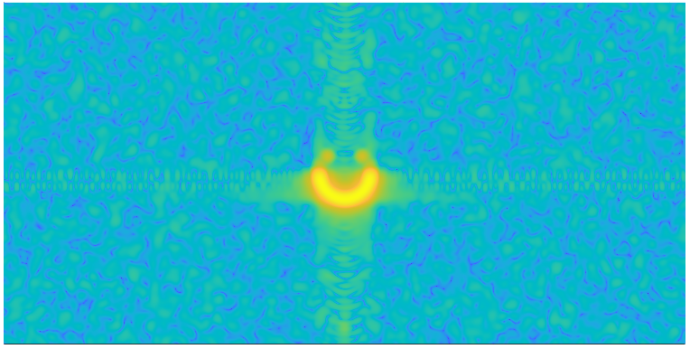

# RadarSimM

Radar Simulator for MATLAB.

## Introdcution

`RadarSimM` is the MATLAB interface of RadarSimX. It utilizes the powerful C++/CUDA backend engine `RadarSimCpp`. This interface is designed to provide radar transceiver modeling and baseband simulation capabilities for both point targets and 3D models. It offers similar features as the `RadarSimPy` interface.

| RadarSimPy | RadarSimM |
| ---------- | --------- |
|  |  |
|  |  |
|  |  |

## Dependence

- MATLAB

## Installation

- Download the compiled module from [RadarSimM](https://radarsimx.com/product/radarsimm/)
- Put `@RadarSim` folder into your workpath.

## Usage

Check the examples files `example_*.m`.

## Key Features

- ### Radar Modeling

  - Radar transceiver modeling
  - Arbitrary waveform
  - Phase noise
  - Phase/amplitude modulation
  - Fast-time/slow-time modulation

- ### Simulation

  - Simulation of radar baseband data from point targets
  - Simulation of radar baseband data from 3D modeled objects/environment (**`#raytracing`**)
  - (TODO) Simulation of interference
  - (TODO) Simulation of target's RCS (**`#raytracing`**)
  - (TODO) Simulation of LiDAR point cloud from 3D modeled objects/environment (**`#raytracing`**)
