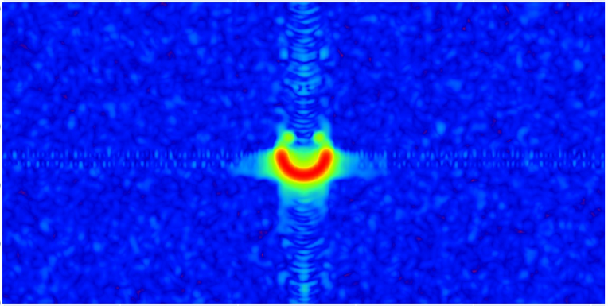

# RadarSimM

Radar Simulator for MATLAB.

## Introdcution

[`RadarSimM`](https://radarsimx.com/product/radarsimm/) is the MATLAB interface of RadarSimX. It utilizes the powerful C++/CUDA backend engine [`RadarSimCpp`](https://radarsimx.com/radarsimx/radarsimcpp/). This interface is designed to provide radar transceiver modeling and baseband simulation capabilities for both point targets and 3D models. It offers similar features as [`RadarSimPy`](https://radarsimx.com/product/radarsimpy/).

| RadarSimPy | RadarSimM |
| ---------- | --------- |
|  |  |
|  |  |
|  |  |

## Dependence

- MATLAB 64bit
- [MinGW-w64 C/C++ compiler](https://www.mathworks.com/support/requirements/supported-compilers.html) (Windows)

## Installation

- Download the compiled module from [RadarSimM](https://radarsimx.com/product/radarsimm/)

## Usage

Check the files in `examples`.

## Key Features

- ### Radar Modeling

  - Radar transceiver modeling
  - Arbitrary waveform
  - Phase noise
  - Phase/amplitude modulation
  - Fast-time/slow-time modulation

- ### Simulation

  - Simulation of radar baseband data from point targets
  - Simulation of radar baseband data from 3D modeled objects/environment
  - Simulation of interference
  - (TODO) Simulation of target's RCS
  - (TODO) Simulation of LiDAR point cloud from 3D modeled objects/environment
